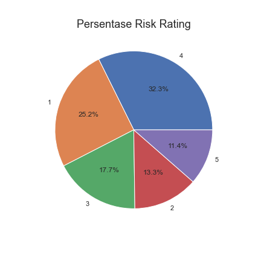
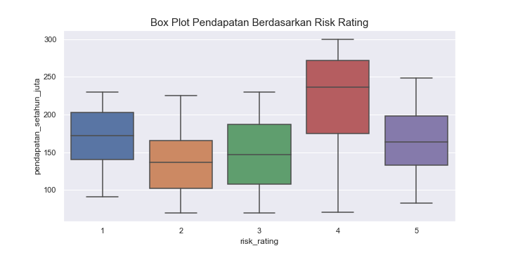
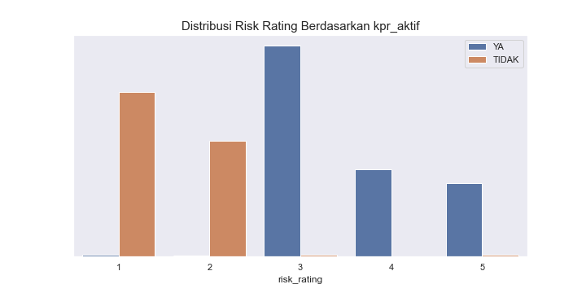
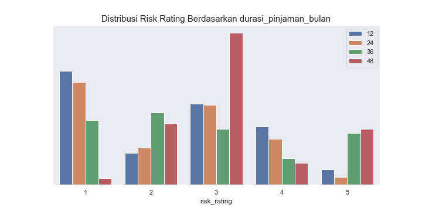
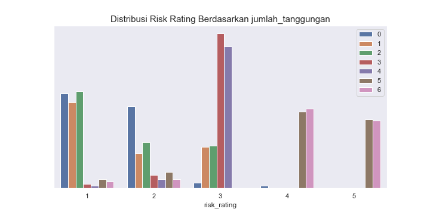

# Credit Risk Analysis

- Nama : Rahmat Fajri
- Email : rfajri912@gmail.com
- [Portofoli](https://rfajri27.github.io/MyPortfolio/)

Project ini menggunakan data *risk rating* berdasarkan data historis lamanya proses pengembalian pinjaman. Pada project ini akan dilakukan analisis terhadpa data dan membuat *decision making model* terhadap pengajuan pinjaman baru.

## Exploratory Data Analysis

### Persentase Risk Rating



Berdasarkan plot tersebut diketahui bahwa dari keseluruhan pengajuan pinjaman terdapat 43.7% yang memiliki resiko tinggi (rating 4 dan 5)

### Box Plot Pendapatan Berdasarkan Risk Rating



### Distribusi of Risk Rating







- Jika durasi pinjaman lebih dari 24 bulan, kecenderungan resikonya tinggi
- Jika jumlah tanggungan lebih dari 4, kecenderungan resikonya sangat tinggi (rating 4 dan 5)
- Jika peminjam memiliki KPR aktif, kecenderungan resikonya tinggi

## Modelling using Decision Tree

```
Prediction Report (Data Training) :
Accuracy:  1.0

Prediction Report (Data Testing):
Accuracy:  1.0
```

## Conclusion

- Dari keseluruhan pengajuan pinjaman terdapat 43.7% yang memiliki resiko tinggi (rating 4 dan 5)
- Kredit risk cenderung tinggi untuk kategori berikut:
    - Memiliki KPR aktif
    - Memiliki jumlah tanggungan lebih dari 4
    - Durasi pinjaman lebih dari 24 bulan
- Dengan menggunakan model *Decision Tree* kita dapat membuat model untuk memprediksi nilai *risk rating* dengan akurasi yang sangat baik, sehingga model ini dapat dijadikan sebagai basis pengambilan keputusan terhadap aplikasi pinjaman baru
